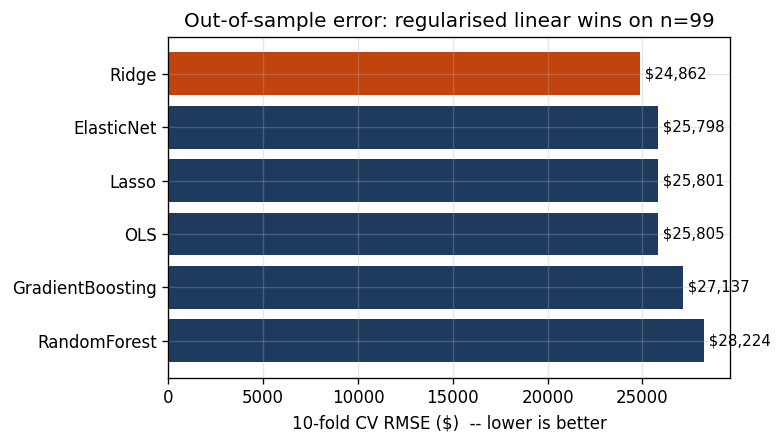
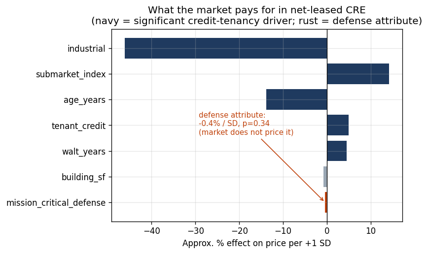
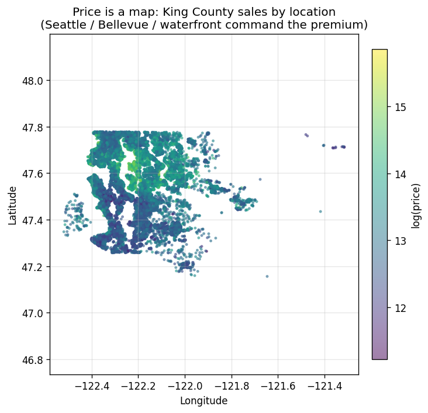

# Hedonic Pricing — what a property characteristic is worth

A compact, reproducible study that estimates how much a single building
characteristic — the presence of **urea-formaldehyde foam insulation (UFFI)** —
changes a home's sale price, after controlling for everything else about the
property. The same machinery, a **hedonic regression**, is the analytical
backbone of how acquisitions teams underwrite an asset's value from its
attributes.

The project is implemented **twice, side by side** — once in **R** and once in
**Python** — so the modelling choices are language-independent and easy to
audit. Every headline number below was produced by the code in this repo.

> **Companion repos** — this is the *valuation* leg of an acquisitions toolkit.
> The *credit* leg, scoring tenant default risk with cost-sensitive decisions, is
> [**credit-risk-underwriting**](https://github.com/PeterJemley/credit-risk-underwriting);
> the *market-research* leg, screening submarkets and competitive assets, is
> [**geospatial-market-analytics**](https://github.com/PeterJemley/geospatial-market-analytics).

---

## Headline results

| Question | Answer | Where |
|---|---|---|
| Can an attribute the market *ignores* be priced? | A **mission-critical defense lease** reads **−0.4%, not significant** (priced as generic credit tenancy) → underwriting it yields **~10.7% capturable** at a 75 bps overlay (~$10.8M / 1.0M SF) | [defense-lease demo](docs/cre_defense_platform.md) |
| Does the method scale to real market data? | Same engine on **21,613 King County sales** → **R² 0.88** out-of-sample; tree ensembles overtake linear models, and **location is the #1 driver** | [King County module](docs/kingcounty_valuation.md) |
| What does UFFI do to value? | **−6% of price** (log model, p ≈ 0.08); **−$14,700** in a simpler dollar model (p ≈ 0.02) | [`06_characteristic_effects.png`](figures/06_characteristic_effects.png) |
| Best out-of-sample model (n = 99) | **Ridge regression on log price**, 10-fold CV RMSE **$24,862**, R² **0.62** | [`04_model_leaderboard.png`](figures/04_model_leaderboard.png) |
| Value of an example home | **$160,900**, 95% prediction interval **$117,600 – $204,200** | [`07_prediction_interval.png`](figures/07_prediction_interval.png) |
| Biggest price drivers | Living area (+13% / SD) and sale year, i.e. the market cycle (+9% / SD) | [`06_characteristic_effects.png`](figures/06_characteristic_effects.png) |



---

## What this gets right

Originated as graduate coursework (Northeastern, *DA5030 Machine Learning*, 2019)
and rebuilt and extended to a professional standard. The emphasis is on the four
disciplines that separate a hedonic model you can underwrite against from one
that merely *looks* accurate — each a common pitfall in practice:

1. **Don't delete the expensive assets.** Trimming the response variable to
   remove "outliers" is the most common way to fake a good error number. On this
   data, dropping every sale more than 1.5 SD from the mean discards **26% of the
   homes and every sale above $179k** (the true maximum is $347k), pulling the
   reported error from a realistic **$24,317** down to an artificial **$16,720**.
   This pipeline keeps every observation and instead *flags* influence with
   Cook's distance.
2. **Measure error out-of-sample.** In-sample residuals flatter a model. Every
   headline number here is **10-fold cross-validated** and reported in dollars.
3. **Quote a correct prediction interval.** The `point ± 1.96 × residual_SE`
   shortcut understates uncertainty; this uses a proper prediction interval that
   also accounts for the uncertainty in the fitted coefficients.
4. **Model the skew, keep the signal.** Price is right-skewed, so the target is
   modelled on the **log scale**, and the `year_sold` market-cycle variable is
   retained as a price driver.

The reasoning behind each, with verified numbers: [`docs/methodology.md`](docs/methodology.md).

---

## Commercial extension — pricing a systematic mispricing

The same engine, pointed at commercial real estate, demonstrates a concrete
underwriting edge: **measuring an attribute the market fails to price.**

In a transparently simulated book of net-leased industrial/office assets, a
hedonic model fit on transaction prices shows the market pays for the
credit-tenancy attributes (tenant credit, lease term, submarket) but assigns a
*mission-critical defense lease* an effect of **−0.4%, statistically
indistinguishable from zero** — i.e. it is priced as generic credit tenancy.
Underwriting that attribute as defense infrastructure (a sensitivity-tested
cap-rate compression) converts it into a capturable spread: at a 75 bps base
case, **~10.7% of value (~$10.8M per 1.0M SF)**.



This is the same statistics as the housing study with the sign flipped — there,
an attribute the market *discounts*; here, one it *ignores*. Full walkthrough,
sensitivity table, and scope/disclaimers: [`docs/cre_defense_platform.md`](docs/cre_defense_platform.md).

---

## Scaling to real market data — 21,613 King County sales

The 99-home study is deliberately small and has no geography. The same engine,
pointed at **21,613 real King County, WA sales (2014–2015)** via one new config,
shows what scale changes:

- **R² 0.88 out-of-sample**, and the leaderboard *flips* — with this much data,
  **Random Forest** (RMSE ~$130k) overtakes the linear models that won on 99
  homes. That reversal is the bias–variance trade-off, not a contradiction.
- **Location is the #1 driver** (latitude +20.7% / SD) — the spatial signal the
  small study flagged as missing. Plotted by coordinates and colored by price,
  the county draws itself.



Walkthrough and numbers: [`docs/kingcounty_valuation.md`](docs/kingcounty_valuation.md).

---

## What's in here

```
hedonic-property-valuation/
├── data/        UFFI + 21,613 King County sales + a full data dictionary
├── python/      reusable pipeline + housing notebook + CRE & King County modules
├── R/           the same housing analysis as a commented R Markdown report
├── figures/     thirteen committed visualizations (regenerated from data)
└── docs/        methodology, applications, and the CRE / acquisitions write-ups
```

- **`python/uffi_pipeline.py`** — a small, **dataset-agnostic** hedonic engine.
  Point it at a different priced-asset dataset by writing one `HedonicConfig`
  and changing nothing else.
- **`python/kingcounty_valuation.py`** — the engine on 21,613 real sales:
  scale and location handling.
- **`python/cre_defense_lease.py`** — the engine applied to commercial real
  estate: detecting and pricing an attribute the market ignores.
- **`R/uffi_hedonic_model.Rmd`** — the housing workflow as a knit-ready R report.
- **`docs/kingcounty_valuation.md`** — scaling to real market data.
- **`docs/cre_defense_platform.md`** — the defense-leased mispricing demonstration.
- **`docs/cre_acquisitions.md`** — how the toolkit maps to acquisitions work.
- **`docs/applications.md`** — how it transfers to other commerce areas.

---

## Run it

**Python**
```bash
pip install -r requirements.txt
python python/uffi_pipeline.py        # housing: prints the full report
python python/make_figures.py         # housing: regenerates figures 01–07
python python/cre_defense_lease.py    # commercial: the defense-lease demo
python python/make_cre_figures.py     # commercial: regenerates figures 08–10
python python/kingcounty_valuation.py # 21,613 real sales (~4 min)
python python/make_kc_figures.py      # King County: regenerates figures 11–13
jupyter notebook python/uffi_hedonic_model.ipynb
```

**R**
```r
install.packages(c("tidyverse","readxl","janitor","caret","glmnet",
                   "ranger","car","broom","e1071"))
# open R/uffi_hedonic_model.Rmd in RStudio and Knit
```

Both languages read the same `data/uffidata.xlsx` and reproduce the same
conclusions.

---

## A note on scope

Every dataset here is local and/or dated (and the commercial book is a labeled
simulation). The **method** generalizes; the **specific coefficients do not** —
they illustrate technique, not a transferable appraisal. See
[`docs/applications.md`](docs/applications.md) for where the approach extends and
where it doesn't.
