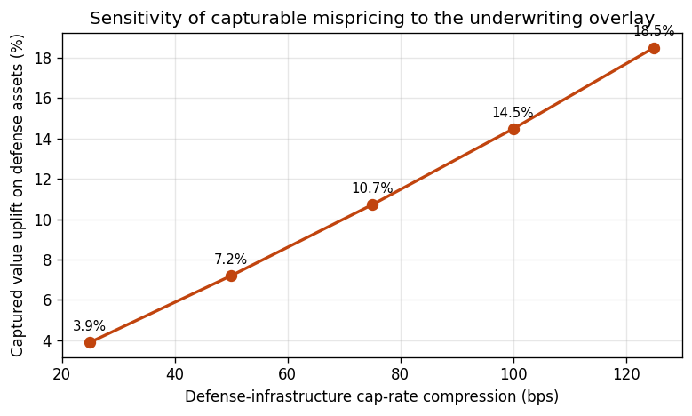
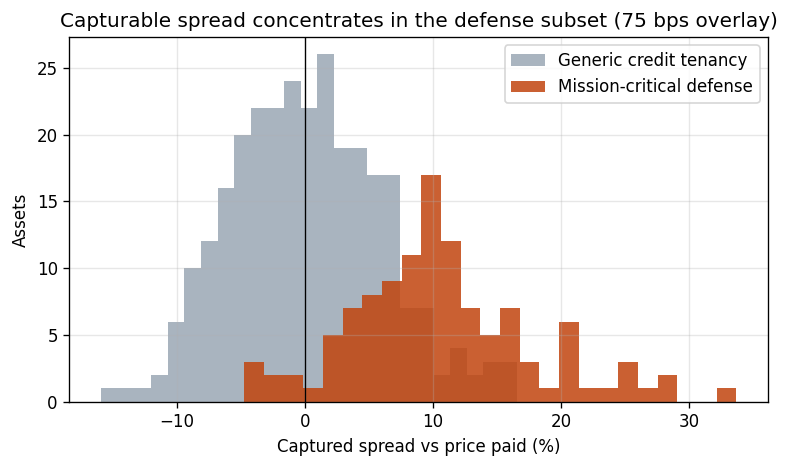

# Commercial extension — pricing a defense-leased mispricing

> **This is a transparent simulation, not real transactions or any firm's deal
> data.** A seeded generator (`python/cre_defense_lease.py`) produces a synthetic
> book of net-leased commercial assets whose prices reflect *generic credit
> tenancy* — building quality, location, lease term, and tenant credit. The
> defense attribute is deliberately left out of the price mechanism so the
> demonstration can show an estimator *detecting* its absence. Every number here
> is reproduced by that script. The underwriting overlay is an explicit,
> sensitivity-tested assumption, not a claim about any specific asset.

## The thesis, in one line

A mission-critical facility leased to a prime defense contractor carries
durability the generic credit-tenancy frame misses — procurement-backed cash
flows, high relocation cost, sticky renewals. If the market does not price that
attribute, the asset is **systematically mispriced**, and the gap is capturable
at acquisition.

This is the **same statistical problem as the UFFI housing study**, with the
sign flipped. There, a binary attribute the market *discounts* (−6%). Here, a
binary attribute the market *ignores* (≈ 0%). One hedonic estimator measures
both.

## Step 1 — Does the market price the defense attribute?

We fit the same hedonic engine (one new `HedonicConfig`, nothing else changed)
on the transaction prices and read the coefficients:

| Attribute | Effect on price (per +1 SD) | Significant? |
|---|---|---|
| Submarket quality | **+14.2%** | yes |
| Age | **−13.9%** | yes |
| Tenant credit | **+4.9%** | yes |
| Lease term (WALT) | **+4.4%** | yes |
| **Mission-critical defense** | **−0.4%** | **no (p = 0.34)** |

The credit-tenancy attributes are priced exactly as you'd expect. The defense
attribute lands at **−0.4%, not statistically distinguishable from zero** — the
market priced these assets as generic credit tenancy. *That ~0 coefficient is
the test:* on real comparable sales, a defense coefficient indistinguishable
from zero is what validates the mispricing thesis. (Here it is ~0 by
construction, which doubles as a recovery check — the estimator correctly finds
no premium in prices that contain none.)

## Step 2 — Underwrite it as defense infrastructure

The capturable spread is the value an analyst underwrites *with* the defense
characteristics, minus the price the generic market paid. We express the
underwriting judgment as a **cap-rate compression** applied to the
mission-critical subset — grounded in FAR/DFARS-backed cash-flow durability and
relocation cost — and run it as a sensitivity, because the assumption is exactly
what diligence should pin down:

| Cap-rate compression | Captured value uplift | Per SF | Per 1.0M SF acquired |
|---|---|---|---|
| 25 bps | 3.9% | $3.48 | $3.5M |
| 50 bps | 7.2% | $7.04 | $7.0M |
| **75 bps (base case)** | **10.7%** | **$10.84** | **$10.8M** |
| 100 bps | 14.5% | $14.91 | $14.9M |
| 125 bps | 18.5% | $19.28 | $19.3M |

At the base case, the spread is concentrated entirely in the defense subset;
generic assets sit at ~0, because the market already priced them correctly:

## How this maps to the acquisitions workflow

| Underwriting task | In this demonstration |
|---|---|
| **Financial modeling on prospective acquisitions** | NOI → cap-rate → value per SF, with the underwritten value vs. price-paid spread |
| **Sensitivity analysis** | Captured spread swept across the cap-rate-compression assumption (25–125 bps) |
| **Market research / supply-demand** | Submarket index and asset-type as priced drivers; the framework extends to absorption and pipeline features |
| **Tenant & credit diligence** | Tenant-credit and WALT enter as explicit, priced attributes |
| **Government-contract exposure (FAR/DFARS)** | The mission-critical defense flag is the attribute under test; the overlay encodes procurement-backed durability |
| **IC materials** | A defensible spread, a clear sensitivity table, and a one-look chart of where the value sits |

## Honest scope

The book is synthetic and the overlay is an assumption — by design, so the
mechanism is visible and the estimator's behavior is checkable against a known
truth. Pointed at a real comparable set, the **same code** runs the same test:
estimate whether the market prices a given attribute, and if it doesn't, size
and stress-test the spread. The value here is the *method and the discipline* —
attribute-level valuation, an explicit and sensitivity-tested thesis, and an
out-of-sample habit — not the specific figures.

See [`applications.md`](applications.md) for the general "any priced asset" case
and [`cre_acquisitions.md`](cre_acquisitions.md) for the broader mapping to
acquisitions work.
