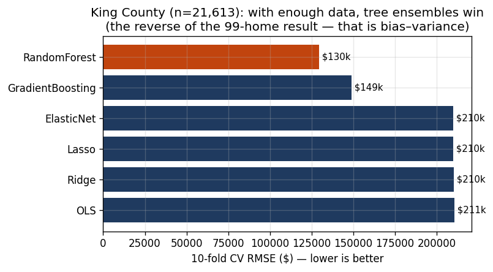
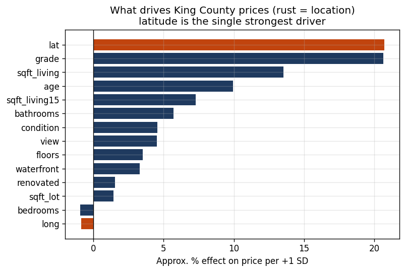

# Scaling the engine — 21,613 real King County sales

The UFFI study is deliberately small (99 homes) and has no geography. This module
runs the **same hedonic engine** on a real, market-scale dataset — **21,613 home
sales in King County, WA (2014–2015)** — to show two things the small set
couldn't: how model choice changes with scale, and how much of price is just
*location*.

Reuse is the point: retargeting the engine took **one new `HedonicConfig`** and
two engineered columns (`age`, a `renovated` flag). No modelling code was
rewritten. Every number below is reproduced by
[`python/kingcounty_valuation.py`](../python/kingcounty_valuation.py).

## The dataset

- 21,613 arm's-length sales; price median **$450,000**, range $75k–$7.7M.
- Right-skewed like all prices (skew **4.02** raw → **0.43** logged) — the log
  target matters even more here than on the UFFI set.
- 14 modelled features, including **latitude and longitude** — the spatial signal
  the UFFI study explicitly lacked.

## Result 1 — with enough data, the leaderboard flips

| Model (10-fold CV) | RMSE | R² |
|---|---|---|
| **Random Forest** ← best | **$129,587** | **0.875** |
| Gradient Boosting | $149,008 | 0.835 |
| Elastic Net | $209,825 | 0.673 |
| Lasso | $209,878 | 0.673 |
| Ridge | $210,322 | 0.672 |
| OLS | $210,549 | 0.671 |



On 99 UFFI homes, **Ridge won and the tree ensembles overfit.** Here the ranking
is **reversed**: Random Forest cuts the error nearly in half relative to the
linear models. That isn't a contradiction — it's the bias–variance trade-off
working exactly as it should. Flexible models need data to support them; at 99
rows they don't have it, at 21,613 they do. *Letting cross-validation pick the
model, rather than assuming the complex one is better, is the whole discipline.*

A caveat worth stating: winning on RMSE is not the same as carrying the
explanation. The forest's victory is best read as a *finding* — that the linear
specification omits spatial structure (price is largely a function of *where*) —
and the proper response is to repair the model with that structure, not to treat
an opaque forest as the last word. See [`../EXPLAINER.md`](../EXPLAINER.md) §8.

## Result 2 — price is mostly a map

Strongest drivers, as the % price effect of a one-standard-deviation increase:

| Driver | Effect / SD |
|---|---|
| **Latitude (location)** | **+20.7%** |
| Construction grade | +20.6% |
| Living area | +13.5% |
| Age | +10.0% |
| Neighbors' living area (`sqft_living15`) | +7.3% |



**Latitude is the single strongest driver** — north-south position in the county
moves price more than any physical attribute except build quality. Plot every
sale at its coordinates, color by price, and the county draws itself: the premium
concentrates around Seattle, Bellevue, and the Lake Washington waterfront.


This directly answers the limitation flagged in the UFFI study
([`methodology.md`](methodology.md) §11): "with location features a spatial model
would almost certainly beat this one." Here it does, and location is the
dominant signal.

## What this adds to the project

- **Removes the small-n objection.** The same pipeline that priced 99 homes
  prices 21,613 real sales at R² 0.88 out-of-sample.
- **Demonstrates judgment about model choice.** The honest conclusion changes
  with the data — and the code reports it rather than forcing a favorite.
- **Shows location handling.** The spatial signal the UFFI set lacked is here the
  headline driver — relevant anywhere value is "location, location, location."

## Honest scope

King County 2014–2015 is residential and geographically specific; the
coefficients are local and dated. As everywhere in this repo, the transferable
asset is the **method and the discipline** — log target, out-of-sample
validation, model selection by cross-validation, and reading what actually drives
value — not the specific numbers.

## Run it

```bash
python python/kingcounty_valuation.py   # full report (~4 min: 21k rows × CV)
python python/make_kc_figures.py         # regenerates figures 11–13
```
